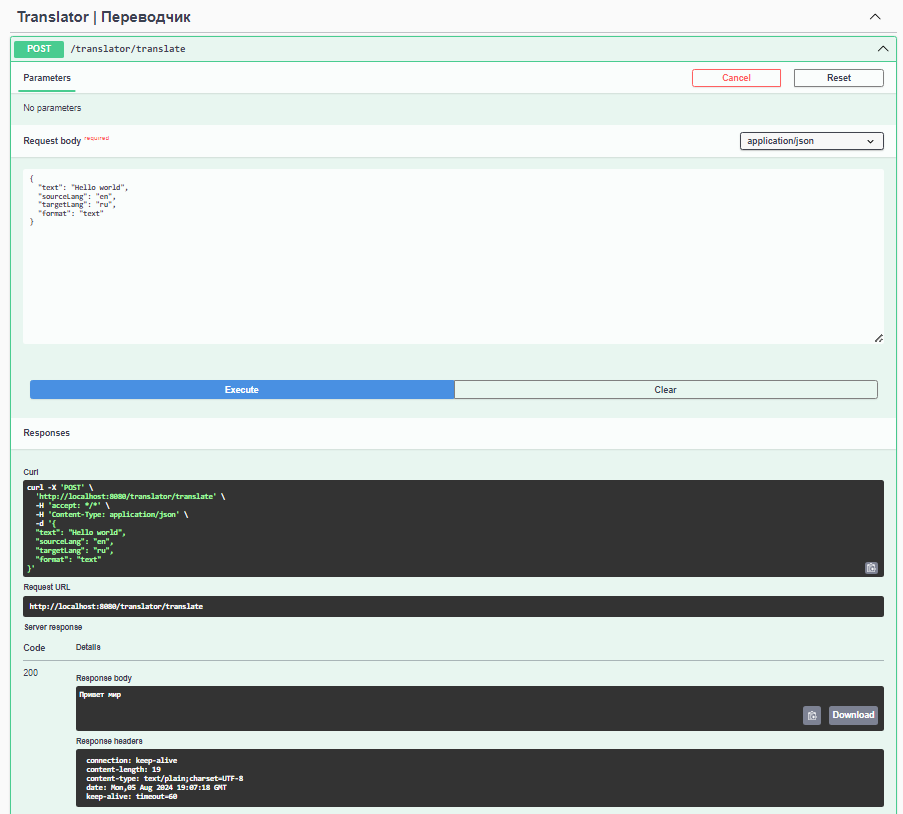
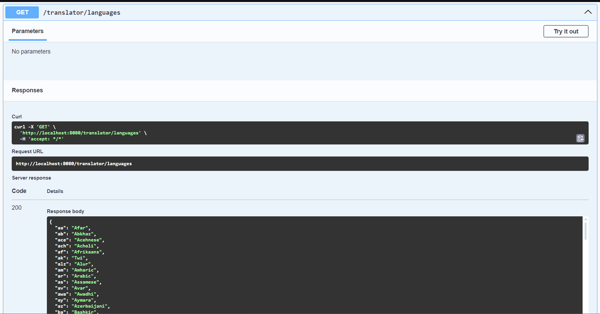

# Переводчик на Java с использованием Spring Boot и GoogleTranslate API

## Описание

Это приложение переводит набор слов с одного языка на другой, используя GoogleTranslate с помощью платформы Rapid API

## Запуск приложения

1. Клонируйте репозиторий: *git clone <url>*

2. Перейдите в каталог проекта: *cd <directory>*

3. Настройте подключение к API: Для получения ключа необходимо пройти регистрацию на сервисе 
https://rapidapi.com/IRCTCAPI/api/google-translator9/playground/apiendpoint_ef9d7a05-8882-438c-b4a6-19469f5f5f9c, 
получить ключ и вписать его в файле application.properties в поле rapidapi.key:
   *rapidapi.key=YOUR_KEY*

4. Настройте подключение к базе данных: Используйте schema.sql для создания таблицы в H2 Database. таже необходимо заполнить следующие поля в application.properties:
   *spring.datasource.username=YOUR_USERNAME*
   *spring.datasource.password=YOUR_PASSWORD*

4. Соберите проект с помощью Gradle: *./gradlew build*

5. Запустите приложение: *./gradlew bootRun*

6. http://localhost:8080 — Адрес приложения

## Использование
Для удобства использования приложения можно перейти по ссылке: http://localhost:8080/swagger-ui.html

Отправьте POST запрос на `/translate` с параметрами `sourceLang`, `targetLang` и `text`

Пример запроса:
Для выполнения перевода, отправьте POST-запрос на /translate с телом вида:
curl -X 'POST' \
'http://localhost:8080/translator/translate' \
-H 'accept: */*' \
-H 'Content-Type: application/json' \
-d '{
"text": "Hello world",
"sourceLang": "en",
"targetLang": "ru",
"format": "text"
}'

Чтобы получить список доступных языков, отправьте Get-запрос на /languages
curl -X 'GET' \
'http://localhost:8080/translator/languages'

## Примечания
Максимальное количество одновременно выполняемых переводов — 10
Результаты переводов сохраняются в памяти базы данных H2

Примеры запросов:

